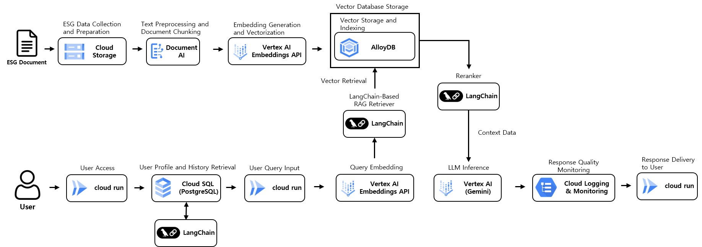

<a id="readme-top"></a>

[![Contributors][contributors-shield]][contributors-url]
[![Forks][forks-shield]][forks-url]
[![Stars][stars-shield]][stars-url]
[![Issues][issues-shield]][issues-url]
[![MIT License][license-shield]][license-url]

<br/>

<div align="center">

# ESG AI Agent

Production-grade **Retrieval-Augmented Generation (RAG)** platform for ESG report analysis built on **Google Cloud Platform**.

Semantic document search and LLM-based reasoning over ESG reports using **Vertex AI, AlloyDB (pgvector), and LangChain**.

</div>

---

# Overview

ESG reports contain large volumes of **unstructured text, tables, and domain-specific terminology**, making traditional keyword search ineffective.

This project implements a **cloud-native RAG system** that enables:

- semantic ESG document retrieval
- document-grounded LLM responses
- conversational ESG knowledge exploration

The system integrates **document processing, vector retrieval, and LLM inference** into a scalable production architecture on Google Cloud.

---

# System Architecture

<div align="center">

</div>

---

# Retrieval Flow

```
┌───────────────┐
│    User Query │
└───────┬───────┘
        ↓
┌──────────────────────┐
│ Cloud Run (FastAPI)  │
│ API Gateway          │
└───────┬──────────────┘
        ↓
┌──────────────────────┐
│ Vertex AI Embedding  │
│ Query Vectorization  │
└───────┬──────────────┘
        ↓
┌────────────────────────────┐
│ AlloyDB (pgvector)         │
│ Semantic Vector Retrieval  │
└───────┬────────────────────┘
        ↓
┌────────────────────────────┐
│ Retriever + Reranker       │
│ Context Ranking            │
└───────┬────────────────────┘
        ↓
┌────────────────────────────┐
│ Gemini LLM (Vertex AI)     │
│ Response Generation        │
└───────┬────────────────────┘
        ↓
┌───────────────┐
│ Final Answer  │
└───────────────┘
```

---

# Document Ingestion Pipeline

```
┌──────────────────────┐
│ ESG Document Upload  │
│ (Google Cloud Storage)
└──────────┬───────────┘
           ↓
┌──────────────────────┐
│ Cloud Function       │
│ Event Trigger        │
└──────────┬───────────┘
           ↓
┌──────────────────────┐
│ Document AI OCR      │
│ Layout Extraction    │
└──────────┬───────────┘
           ↓
┌──────────────────────┐
│ Layout Parsing       │
│ Text / Table Blocks  │
└──────────┬───────────┘
           ↓
┌──────────────────────┐
│ Chunking Pipeline    │
│ (512 token chunks)   │
└──────────┬───────────┘
           ↓
┌──────────────────────┐
│ Vertex AI Embedding  │
│ Vector Generation    │
└──────────┬───────────┘
           ↓
┌──────────────────────────┐
│ AlloyDB Vector Storage   │
│ pgvector Indexing        │
└──────────────────────────┘
```

This pipeline enables **fully automated ESG document ingestion and indexing**.

---

# Key Features

### Document Intelligence

- ESG PDF ingestion pipeline
- OCR using **Document AI**
- layout-aware parsing
- table / paragraph chunk separation

### Retrieval-Augmented Generation

- semantic vector search with **AlloyDB pgvector**
- embeddings generated via **Vertex AI**
- LLM inference using **Gemini**

### Conversational AI

- session-based interaction
- multi-turn dialogue
- persistent chat history

---

# RAG Strategy

This system implements several retrieval optimization techniques.

### Vector Similarity Retrieval

User queries are embedded using **Vertex AI embeddings** and compared against document chunks using cosine similarity.

Query → Embedding → Vector Search → Top-K Retrieval

---

### Metadata-aware Retrieval

Chunk metadata improves retrieval quality.

Example metadata:

```
{
 "start_page": 5,
 "block_type": "text",
 "chunk_index": 2
}
```

Benefits:

- page-aware context prioritization
- table specific retrieval
- document traceability

---

### Similarity Threshold Filtering

Low relevance chunks are removed before prompt construction.

Benefits:

- reduces noisy context
- improves LLM grounding

---

### Cross-Encoder Reranking

Retrieved chunks are reranked using a cross-encoder model evaluating **query-context relevance**.

Benefits:

- improved answer precision
- better context ranking

---

### Context Deduplication

Duplicate chunks are removed before LLM prompt construction.

Benefits:

- lower token usage
- clearer context

---

# Database Design

## Vector Database (AlloyDB)

AlloyDB with **pgvector** is used for semantic retrieval.

### documents

| column | type | description |
|------|------|-------------|
| id | UUID | document id |
| title | TEXT | document title |
| source_uri | TEXT | document location |
| created_at | TIMESTAMP | ingestion time |

### chunks

| column | type | description |
|------|------|-------------|
| id | UUID | chunk id |
| document_id | UUID | parent document |
| page_number | INT | source page |
| block_type | TEXT | text / table |
| content | TEXT | chunk content |
| embedding | VECTOR(768) | semantic embedding |
| metadata | JSONB | chunk metadata |

Vector Index

```
ivfflat (embedding vector_cosine_ops)
```

---

## Application Database (Cloud SQL)

User accounts and conversation history are stored in **Cloud SQL (PostgreSQL)**.

### Schema Overview

| Table | Description |
|------|-------------|
| User | user account information |
| LoginLog | login activity logs |
| ChatSession | conversation session grouping |
| ChatLog | user-AI message history |

This schema enables **persistent multi-turn conversational context**.

---

# Design Decisions

### Why AlloyDB (pgvector)

AlloyDB was selected as the vector store instead of external vector databases (e.g., Pinecone, Weaviate) to keep the retrieval system tightly integrated with the existing relational infrastructure.

Key reasons:

- **High-performance vector similarity search** through the `pgvector` extension with `ivfflat` indexing
- **Low-latency semantic retrieval** suitable for production RAG pipelines
- **Native PostgreSQL compatibility**, allowing both relational queries and vector search within the same database
- **Reduced infrastructure complexity** by avoiding additional external vector database services

This architecture simplifies the system while maintaining **efficient large-scale vector retrieval for ESG document search**.

---

### Why Document AI Layout Parser

ESG reports often contain complex layouts including **tables, multi-column text, and structured sections**.

Using standard OCR alone often loses structural information.

To address this, the system uses **Google Cloud Document AI with Layout Parser**, which provides:

- **layout-aware document understanding**
- extraction of **text blocks, table blocks, and structural elements**
- preservation of document structure for accurate chunk generation

This allows the RAG pipeline to create **semantically meaningful chunks** rather than naive text splits, improving retrieval accuracy for ESG reports that rely heavily on structured content.

---

### Why Metadata-based Retrieval

Embedding similarity alone is insufficient for complex documents.

Metadata enables:

- page-aware retrieval
- block-type filtering (text vs table)
- traceability to original document context

This improves retrieval precision for ESG documents.

---

### Why Cross-Encoder Reranking

Vector similarity retrieval is efficient but not always optimal for **answer relevance**.

Cross-encoder reranking evaluates the full **query-context pair**, which leads to:

- improved ranking quality
- better context selection for LLM generation
- reduced hallucination risk

---

# Getting Started

## Prerequisites

- Python 3.10+
- Docker
- Google Cloud SDK
- Google Cloud project with access to:
  - Vertex AI
  - AlloyDB
  - Cloud SQL
  - Document AI

Set environment variables.

```
PROJECT_ID=
VERTEX_AI_LOCATION=
ALLOYDB_HOST=
ALLOYDB_USER=
ALLOYDB_PASSWORD=
CLOUDSQL_HOST=
CLOUDSQL_USER=
CLOUDSQL_PASSWORD=
```

---

## Installation

Clone the repository.

```bash
git clone https://github.com/YeongJuYJ/esg-rag-agent.git
cd esg-rag-agent
```

Install dependencies.

```bash
pip install -r requirements.txt
```

---

## Run the Application

Start the FastAPI server.

```bash
uvicorn main:app --reload
```

Server runs at:

```
http://localhost:8000
```

---

## Docker

Build the container.

```bash
docker build -t esg-rag-agent .
```

Run the container.

```bash
docker run -p 8000:8000 esg-rag-agent
```

---

# Example Query

Below is an example interaction with the ESG RAG system.

**User Query**

```
What are the key ESG initiatives mentioned in the sustainability report?
```

**Retrieval Process**

1. Query is embedded using **Vertex AI Embeddings**
2. Semantic search retrieves relevant chunks from **AlloyDB (pgvector)**
3. Chunks are reranked by the cross-encoder model
4. Context is provided to **Gemini LLM**

**Response Example**

```
The sustainability report highlights three major ESG initiatives:

1. Carbon neutrality roadmap targeting 2040
2. Expansion of renewable energy sourcing
3. Supply chain transparency through ESG reporting

These initiatives focus on environmental sustainability,
corporate governance transparency, and responsible sourcing.
```

The response is generated **strictly based on retrieved document context**, ensuring grounded answers.

# Tech Stack

| Layer | Technology |
|------|------------|
| Backend | FastAPI |
| LLM | Vertex AI Gemini |
| Embedding | Vertex AI Embeddings |
| Retriever | LangChain |
| Vector DB | AlloyDB (pgvector) |
| Application DB | Cloud SQL PostgreSQL |
| Document Processing | Document AI |
| Infrastructure | Google Cloud Platform |
| Containerization | Docker |
| Monitoring | LangSmith |

---

# Project Structure

```
esg-rag-agent
│
├── Dockerfile
├── requirements.txt
│
└── app
    ├── main.py
    ├── db.py
    ├── db_vector.py
    ├── rag_utils.py
    │
    └── templates
        ├── index.html
        ├── login.html
        └── register.html
```

---

# Deployment

```
┌───────────┐
│  GitHub   │
└─────┬─────┘
      ↓
┌──────────────┐
│ Cloud Build  │
│ CI Pipeline  │
└─────┬────────┘
      ↓
┌──────────────────┐
│ Artifact Registry │
└─────┬────────────┘
      ↓
┌───────────────┐
│  Cloud Run    │
│  Deployment   │
└───────────────┘
```

Cloud Run provides:

- serverless container deployment
- automatic scaling
- managed HTTPS endpoint

---

# Contact

YeongJu Shin  
sinyeongju08@gmail.com

Project Repository  
https://github.com/YeongJuYJ/esg-rag-agent


<p align="right">(<a href="#readme-top">back to top</a>)</p>


[contributors-shield]: https://img.shields.io/github/contributors/YeongJuYJ/esg-rag-agent.svg?style=for-the-badge
[contributors-url]: https://github.com/YeongJuYJ/esg-rag-agent/graphs/contributors

[forks-shield]: https://img.shields.io/github/forks/YeongJuYJ/esg-rag-agent.svg?style=for-the-badge
[forks-url]: https://github.com/YeongJuYJ/esg-rag-agent/network/members

[stars-shield]: https://img.shields.io/github/stars/YeongJuYJ/esg-rag-agent.svg?style=for-the-badge
[stars-url]: https://github.com/YeongJuYJ/esg-rag-agent/stargazers

[issues-shield]: https://img.shields.io/github/issues/YeongJuYJ/esg-rag-agent.svg?style=for-the-badge
[issues-url]: https://github.com/YeongJuYJ/esg-rag-agent/issues

[license-shield]: https://img.shields.io/github/license/YeongJuYJ/esg-rag-agent.svg?style=for-the-badge
[license-url]: https://github.com/YeongJuYJ/esg-rag-agent/blob/main/LICENSE
